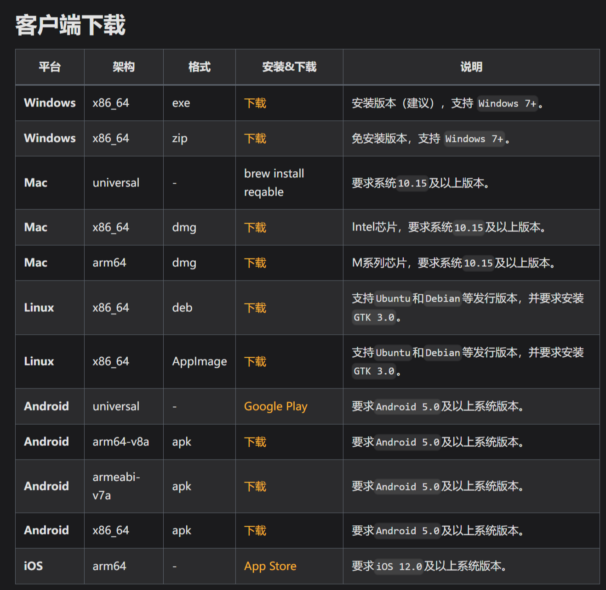
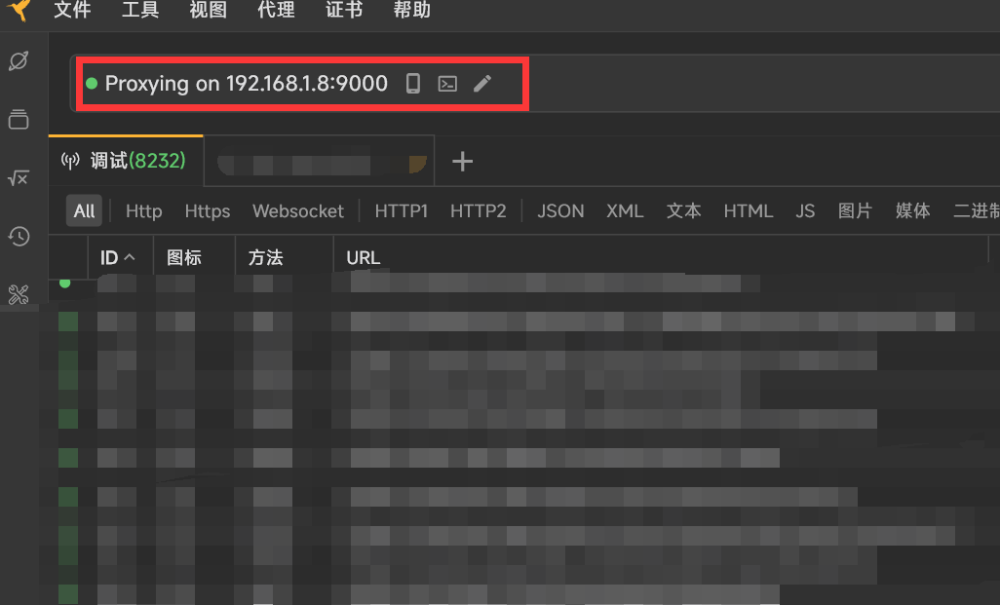
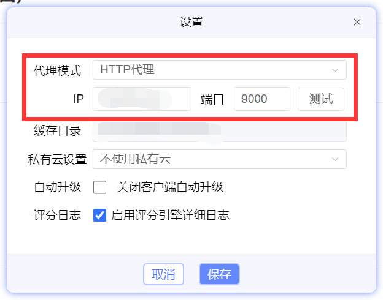
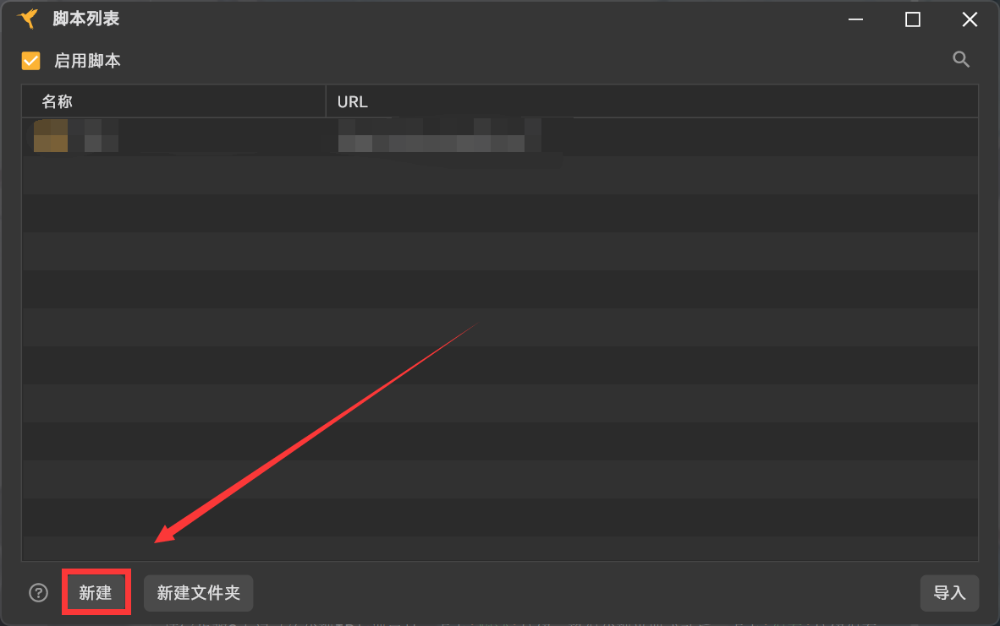
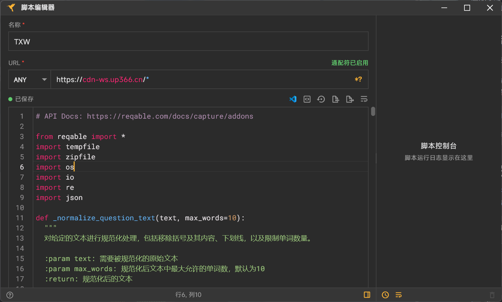

# 天学网答案生成器

> [!CAUTION]
> 本项目仅供学习和研究使用，请在下载后24小时内删除所有相关内容。请勿将本项目用于商业用途或传播！

这是一个基于 [Reqable](https://reqable.com/zh-CN/) 的天学网答案生成器。通过对天学网进行网络抓包，截取课程文件请求数据，并解析为各类题型答案，方便各位快速逃课

## 功能特点

- 支持多种题型：听后选择、听后双项、听后填空、听后转述、朗读短文、朗读并回答问题。
- 自动解析课程文件，提取题目和答案。
- 生成格式化的答案文档，便于查看。

> [!IMPORTANT]
> 本项目**不支持**普通朗读作业
> 
> “*朗读作业为什么还要答案解析？*”

## 使用方法

1. 前往 [Reqable下载页面](https://reqable.com/zh-CN/download/)，下载并安装对应你系统版本的客户端。
> 

2. 打开Reqable客户端，记录地址栏中的代理IP与端口号（默认为9000）。点击地址栏右侧带`S`的类似于文件的图标，开启脚本功能。
> 

3. 打开天学网，点击右上角展开菜单按钮（≡），选择“设置”。将代理模式设置为**HTTP代理**，并填写步骤2中记录的代理IP与端口号，点击`测试`按钮，确保代理设置成功后，点击`保存`按钮保存设置。 
> 

4. 返回Reqable客户端。点击最顶端导航栏`工具`按钮，转到**脚本**页面，点击`新建`按钮。
> 

5. 设置名称，将URL匹配设为`ANY`并将 `https://cdn-ws.up366.cn/*` 填入到URL中，将 [脚本内容](./run.py) 复制到下方的脚本编辑框中，待显示**已保存**后，点击右上角的`X`按钮关闭页面。
> 

6. 返回天学网，打开你需要完成的课程页面（必须是没有下载过的），不出意外待页面加载完成后，会自动弹出一个文本编辑器，内部包含了该课程的答案内容。将内容复制保存到本地即可。

> [!WARNING]
> 文本编辑器打开的文件属于临时文件，一旦关闭无法找回。如果不确定自己是否还要，可以先将内容复制到剪贴板，再关闭编辑器。

## 注意事项

若需要答案的课程已经下载到本地，可以在本地找到 `盘符:\Up366StudentFiles` 删除内部 `\flipbooks` 目录，然后重新打开课程页面以触发脚本。 